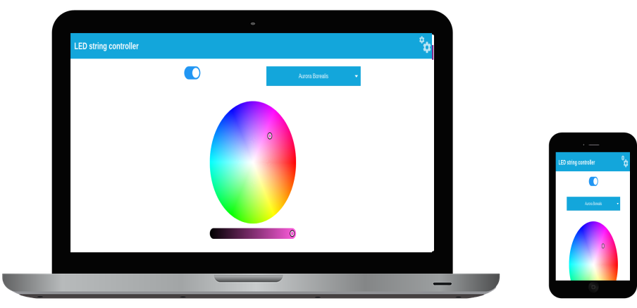

# ledController

This is a sample application to demonstrate my WS2811/WS2812 library.

## Features

- built-in (async) webserver
- communication using websockets
- built-in OTA update using the webpage
- synchronization between multiple simultaneous connected devices
- setting colour, effects and on/off
- external network connections required
- responsive design (limited testing)

## How to use

- download
- install dependencies (or adjust in platformio.ini)
- adjust platformio.ini for credentials and other data
- build & upload to your ESP32

## Known limitations

- hardcoded credentials
- MQTT support is ongoing, requires async mqtt library
- made to build with Platformio
- dependency management is manual, although is easy to be made auto via platformio

## License

see LICENSE.
